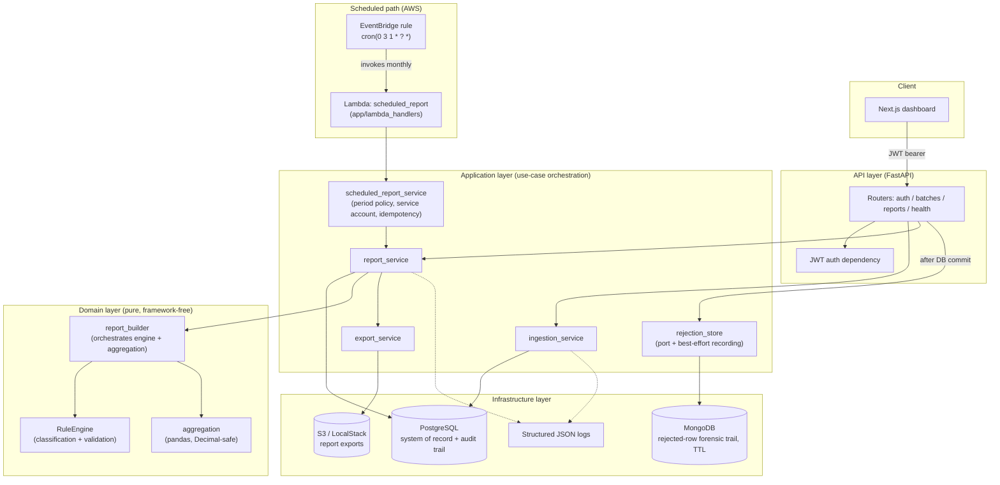

# Compliance Reporting Engine

A backend engine that ingests batches of financial transactions and turns them into **structured, auditable compliance reports** — the kind of pipeline that sits behind recurring regulatory reporting: business-rule validation, aggregation, and full traceability of how every number in the report was produced.

Built as a portfolio project to demonstrate a production-shaped Python/FastAPI backend: a layered architecture, a rule engine that is versioned and independently testable, and an audit trail that answers "how was this number produced?" for every report ever generated.

## The problem it solves

Periodic compliance reporting (AML thresholds, transaction classification, regulatory summaries) needs three things most "just aggregate the data" scripts don't give you:

1. **Business rules that are reviewable and versioned**, not buried in ad-hoc pandas code — because a regulator or auditor will eventually ask "which rules applied to this report, and can you reproduce it?"
2. **Traceability from a report number back to its source transactions** — a total on a report is worthless for compliance if nobody can show which transactions produced it.
3. **A record of what actually happened during generation** — not just the output, but the pipeline trace: what was ingested, what rules ran, what got flagged.

This project implements all three around a small but real domain: transaction classification (retail payment, wire transfer, refund, high-value, etc.) and validation (currency format, threshold, consistency checks).

It also runs **unattended**: an EventBridge schedule triggers an AWS Lambda that produces last month's report with the very same pipeline (see [Scheduled reports](#scheduled-reports-aws-lambda)), and it uses **two databases on purpose** — PostgreSQL for the relational, audit-critical record and MongoDB for the schema-flexible, expiring forensic trail of rejected input (see [Technical decisions](#technical-decisions-what-lives-where-and-why)).

## Screenshots

| Sign in | Reports list |
|---|---|
|  |  |

| Report detail — line items | Report detail — violations |
|---|---|
|  |  |

| Report detail — audit trail | Upload & generate |
|---|---|
|  |  |

## Architecture



**Layering, and why:**

- **`app/domain`** — the rule engine, classification/validation rules, aggregation, and report-building logic. **Zero imports from FastAPI, SQLAlchemy, or any I/O library.** This is deliberate: the rule engine is the part of this system an interviewer (or a real compliance reviewer) will scrutinize most, so it has to be testable and readable in complete isolation — 37 unit tests exercise it with nothing but plain Python objects, no database, no HTTP, running in under 2 seconds.
- **`app/application`** — use-case orchestration (ingest a batch, generate a report, export it) that wires the pure domain logic to persistence and storage. This is the *only* layer that both touches infrastructure and calls into the domain — keeping that intersection to one place is what makes the domain layer's isolation actually hold.
- **`app/infrastructure`** — SQLAlchemy models/repositories, the MongoDB rejection store, the S3 client, JWT/password hashing, structured logging. Talks to the outside world; nothing here contains business logic.
- **`app/api`** — FastAPI routers, request/response schemas, auth dependency. Thin — its job is HTTP translation, not decision-making.
- **`app/lambda_handlers`** — the AWS Lambda entrypoint. It is the *same kind of thing as `app/api`*: an inbound adapter that parses/validates its input (an EventBridge event instead of an HTTP request) and delegates to the application layer. This is what "reuse the domain, don't duplicate it" looks like in practice — the Lambda contains no rules and no reporting logic.

### Why the rule engine is isolated

Because it's the part of the system whose *behavior*, not just its correctness, matters: a reviewer needs to read `classification_rules.py` and `validation_rules.py` and understand exactly what will happen to a transaction, without mentally subtracting out ORM sessions, HTTP request/response cycles, or S3 calls. Isolating it also means the engine can be reused verbatim in a batch job, a Lambda, or a CLI — nothing in it assumes it's running inside a web request. That is not hypothetical here: the [scheduled Lambda](#scheduled-reports-aws-lambda) runs the exact same `generate_report` path as the API.

### Why every report run is audited

A compliance report that can't explain itself isn't a compliance report, it's a spreadsheet. Every `ReportRun` persists:

- **`rule_set_version` + `rule_set_definition_hash`** — which rules ran, with a content hash of their identities and order, so drift between "the code says v1" and "the rules that actually executed" is detectable even after the rule catalog evolves.
- **`input_data_hash`** — a SHA-256 fingerprint of the exact transaction set the report was built from (order-independent), so "was this report really generated from this data?" can be verified without re-trusting the pipeline.
- **A step-by-step audit trail** (`audit_log_entries`) — ingestion loaded, rules applied, validation completed, aggregation completed — each with a timestamp.
- **Every violation raised**, with the rule id, severity, and the specific transaction it applies to.
- **Every aggregated line item's source transaction IDs** — so any number on the report can be traced back to exactly which transactions produced it.

Rule *definitions* live in code (`app/domain/rules/registry.py`), not in an editable database table. A new rule set is added by registering a new version (`v2`, ...) rather than mutating `v1` — existing `ReportRun` rows reference a version string, so mutating a released rule set in place would silently rewrite the meaning of past reports. This trades "rules editable at runtime by a non-engineer" for "rules are under the same code review and git history as everything else" — the right call for a compliance-critical ruleset.

## Tech stack

| Layer | Choice | Why |
|---|---|---|
| API | FastAPI | Async-capable, Pydantic-native validation, automatic OpenAPI docs |
| Validation | Pydantic v2 | Strong typing at the API boundary, kept deliberately separate from business-rule validation (see below) |
| ORM / migrations | SQLAlchemy 2.0 + Alembic | Explicit, typed models (`Mapped[...]`); versioned schema changes |
| Database | PostgreSQL (Docker), SQLite (tests) | Real relational integrity in production; zero-dependency fast tests (see [Testing](#testing)) |
| Batch processing | pandas | Used specifically for the groupby/aggregation step at scale — see [Benchmark](#performance--benchmark) |
| Auth | PyJWT + bcrypt (no passlib) | passlib is unmaintained and breaks on modern bcrypt; calling both libraries directly is simpler and has fewer moving parts |
| PDF export | ReportLab | Mature, dependency-light, produces real tabular PDF reports |
| Object storage | boto3 → S3 / LocalStack | Same code path for local demo and real AWS — only the endpoint URL changes |
| Document store | MongoDB 7 (pymongo) | Schema-flexible, TTL-expiring trail of rejected raw input — deliberately *not* the system of record (see [Technical decisions](#technical-decisions-what-lives-where-and-why)) |
| Serverless / scheduling | AWS Lambda (Python 3.12, zip) + EventBridge rule | Unattended monthly report generation reusing the application layer; LocalStack Community locally |
| Logging | structlog (JSON) | Machine-parseable logs at every pipeline stage |
| Testing | pytest, FastAPI `TestClient`, SQLite, mongomock | 166 tests (99 unit + 67 integration), no external services required; 2 optional contract tests hit a real MongoDB |
| Frontend | Next.js 16 (App Router) + TypeScript + Tailwind | Minimal, client-rendered dashboard — see [Frontend notes](#frontend-notes) |
| CI/CD | GitHub Actions | Lint, test (incl. a real MongoDB service container), Lambda package build + size check, and Docker build on every push |

## Project structure

```
backend/
  app/
    domain/            # pure business logic — rule engine, aggregation, report builder
      rules/            #   classification & validation rules, versioned rule sets
      models/            #   framework-free dataclasses (Transaction, ReportResult, ...)
      services/           #   aggregation.py, report_builder.py
    application/        # use-case orchestration (ingestion, report generation, export,
                        #   scheduled reports, rejection-store port)
    infrastructure/     # SQLAlchemy models/repositories, MongoDB store, S3 client, JWT, logging
    api/                 # FastAPI routers + request/response schemas
    lambda_handlers/    # AWS Lambda entrypoint (inbound adapter, like api/)
    schemas/            # Pydantic DTOs
    core/               # settings (env-var driven)
  alembic/              # migrations
  tests/
    unit/                # domain-only tests, no DB/HTTP
    integration/         # FastAPI TestClient + isolated in-memory SQLite per test
  scripts/
    generate_synthetic_dataset.py
    benchmark.py
    provision_lambda.py   # creates the Lambda + EventBridge schedule (LocalStack or real AWS)
  Dockerfile              # the API image
  Dockerfile.lambda       # builds the Lambda .zip inside the official Lambda base image
frontend/
  app/                  # Next.js App Router pages (login, upload, reports list/detail)
  lib/                  # API client, auth context, TypeScript types
  Dockerfile
docker-compose.yml       # api + db (Postgres) + mongo + localstack (S3/Lambda/EventBridge) + frontend
.github/workflows/ci.yml
```

## Getting started

### Option A — Docker Compose (recommended)

Brings up PostgreSQL, MongoDB, LocalStack (S3), the API (migrations run automatically on boot), and the dashboard.

```bash
docker compose up --build
```

- API: <http://localhost:8000> (docs at `/docs`, health at `/api/v1/health`)
- Dashboard: <http://localhost:3000>
- Postgres: `localhost:5433` (mapped off the standard 5432 to avoid clashing with a local Postgres install — see `docker-compose.yml`)
- MongoDB: `localhost:27018` (root user/password `compliance`; also mapped off the default port)
- LocalStack (S3, Lambda, EventBridge): `localhost:4566`

Open the dashboard, register a demo account, upload `backend/sample_data/synthetic_transactions_2000.csv` (or generate your own — see below), and generate a report for `2026-01-01`–`2026-01-31`.

The scheduled-report Lambda is opt-in, because building it is heavy (it compiles a ~60 MB package inside the Lambda base image):

```bash
docker compose --profile lambda up --build
```

See [Scheduled reports](#scheduled-reports-aws-lambda) for what that does and how to trigger it.

### Option B — Run the backend locally (no Docker)

```bash
cd backend
python -m venv .venv
.venv/Scripts/activate       # Windows; use `source .venv/bin/activate` on macOS/Linux
pip install -e ".[dev]"

cp .env.example .env          # then point DATABASE_URL at a Postgres instance you have running
                              # (MONGO_URL is optional — unset it and the rejection trail is simply off)
alembic upgrade head
uvicorn app.main:app --reload
```

### Generating a synthetic dataset

```bash
cd backend
python scripts/generate_synthetic_dataset.py --count 5000 --format csv --output sample_data/demo.csv
```

Produces realistic transactions with a small, seeded fraction of deliberately malformed rows (to exercise ingestion rejection) and business-rule violations (to exercise the rule engine) — useful for demos and for the benchmark script.

## API reference

All endpoints are under `/api/v1`. Interactive docs (Swagger UI) are served at `/docs` when the API is running.

| Method | Path | Auth | Purpose |
|---|---|---|---|
| GET | `/health` | — | Liveness + DB connectivity check |
| POST | `/auth/register` | — | Demo-only self-registration (see [Security](#security)) |
| POST | `/auth/login` | — | OAuth2 password flow → JWT access token |
| POST | `/batches/upload` | JWT | Upload a CSV/JSON transaction batch |
| GET | `/batches` | JWT | List recent batches |
| GET | `/batches/{id}` | JWT | Batch detail, incl. rejected rows |
| GET | `/batches/{id}/rejections` | JWT | Forensic trail of a batch's rejected rows (raw payload + structured errors), from MongoDB. `limit` (1–500) / `offset`; `503` if MongoDB is unavailable or not configured |
| POST | `/reports` | JWT | Trigger report generation for a period |
| GET | `/reports` | JWT | List generated reports |
| GET | `/reports/{id}` | JWT | Report detail: line items, violations, audit trail |
| GET | `/reports/{id}/export?format=json\|csv\|pdf` | JWT | Download a report export |

## Authentication

JWT (HS256), issued via the standard OAuth2 "password" flow (`POST /auth/login` with `username`/`password` form fields — `username` is the email) so FastAPI's built-in Swagger "Authorize" button works out of the box. Passwords are hashed with `bcrypt` directly (see [Tech stack](#tech-stack) for why not `passlib`).

Deliberately out of scope: refresh tokens, roles/scopes, multi-tenancy. This is a small internal-tool API surface, not a multi-tenant public product — adding that machinery now would be speculative complexity with nothing driving it. If this were productionized for real use, the first thing to add would be role separation (e.g., "can trigger reports" vs. "can only view them").

`POST /auth/register` is intentionally open (no invite code) so this project is runnable end-to-end without a separate seeding step — acceptable for a demo/local environment. A real deployment would gate or remove it.

## The rule engine

Two kinds of rules, evaluated in a fixed order per versioned `RuleSet` (`app/domain/rules/registry.py`):

- **Classification rules** (first match wins) assign a category: `retail_payment`, `wire_transfer`, `internal_transfer`, `refund`, `fee`, `high_value`, `suspicious`. The catch-all `retail_payment` rule is always last.
- **Validation rules** run against the *assigned* category and can raise zero or more violations (`info` / `warning` / `critical`): currency-code format, non-positive amount outside refunds, missing counterparty on a high-value transaction, future-dated transactions.

A deliberate separation exists between **syntactic validation** (Pydantic, at ingestion — is this row shaped correctly?) and **business validation** (the rule engine, at report-generation time — does this transaction satisfy business rules?). Currency format and counterparty-presence are checked by the rule engine, not Pydantic, precisely so the "formato/consistência" validations the engine is meant to demonstrate are real, auditable, per-report-run findings — not silently rejected before the engine ever sees them.

Aggregation groups classified transactions by `(category, currency)` — never mixing currencies into one sum — and computes `total_amount`, `average_amount`, `min_amount`, `max_amount`, and `transaction_count` per group using Python `Decimal` arithmetic throughout (pandas is used for the groupby/indexing machinery, never for the arithmetic itself, so results never pick up binary floating-point rounding error).

## Scheduled reports (AWS Lambda)

Reports don't have to be triggered by a person. An **EventBridge rule** invokes a **Lambda function** on the 1st of every month at 03:00 UTC (`cron(0 3 1 * ? *)`); the function generates the report for the month that just ended, using the same `generate_report` path as `POST /reports`.

```
EventBridge rule ──invoke──▶ Lambda ──▶ scheduled_report_service ──▶ report_service.generate_report
 cron(0 3 1 * ? *)   app.lambda_handlers        (period, identity,        (rule engine, aggregation,
                     .scheduled_report.handler    idempotency)             audit trail, exports → S3)
```

**How it behaves**

- **Period.** The standard EventBridge event carries a `time`; the report covers the previous calendar month *in UTC* (so an event stamped `2026-01-31T23:30:00-05:00` — already Feb 1 in UTC — correctly reports January). An explicit override is accepted for backfills and manual runs: `{"period_start": "2026-01-01", "period_end": "2026-01-31", "rule_set_version": "v1"}`. Invalid events (half an override, reversed dates) are rejected before touching the database.
- **Identity.** There is no logged-in user, so runs are attributed to a dedicated service account, `system@compliance.local`. It is created lazily (no migration or seed step), is `is_active=False` and has a random, discarded password — it cannot authenticate to the API, but every scheduled report is still attributable in `report_runs.triggered_by_user_id`.
- **Idempotency.** EventBridge invokes Lambda *asynchronously* and **retries failed invocations** (up to 2 by default), and at-least-once delivery means duplicates are possible. If a `COMPLETED` run for the same period and rule-set version already exists for the service account, it is returned (`"reused_existing": true`) instead of generating a duplicate. A previous `FAILED` run does not block the retry, and a manual report by a human for the same period does not suppress the scheduled one. Trade-off: data ingested *after* the scheduled run for that period is not picked up automatically; re-run through the API (or with a new rule-set version) when that matters.
- **Failures are loud.** Errors are re-raised, so Lambda records an `Errors` metric, applies its retry policy and can route to an on-failure destination. The failed attempt is also persisted as a `FAILED` `ReportRun` with the error message — the same audit story as an API-triggered failure.
- **Exports.** Lambda's filesystem is read-only except `/tmp`, so exports are staged there (the package defaults `REPORTS_LOCAL_DIR` to `/tmp/report_exports` when it detects the Lambda runtime) and mirrored to S3 — the only copy that outlives the invocation. Accordingly, `GET /reports/{id}/export` **falls back to S3** when the local file isn't on the API host, so scheduled reports are downloadable from the dashboard like any other.

### Run it locally (LocalStack)

```bash
docker compose --profile lambda up --build
```

This starts the normal stack plus a one-shot `lambda-provisioner` that (1) builds the deployment package, (2) uploads it to a LocalStack S3 bucket, and (3) creates the function, the EventBridge rule, the rule-scoped invoke permission and the target — using `backend/scripts/provision_lambda.py`, the same script you would point at a real account. It is idempotent: re-running updates in place.

Invoke it by hand (synchronously) with an explicit period — the sample dataset is January 2026:

```bash
export AWS_ENDPOINT_URL=http://localhost:4566 AWS_ACCESS_KEY_ID=test AWS_SECRET_ACCESS_KEY=test AWS_DEFAULT_REGION=us-east-1
aws lambda invoke --function-name compliance-scheduled-report \
  --cli-binary-format raw-in-base64-out \
  --payload '{"period_start":"2026-01-01","period_end":"2026-01-31"}' out.json && cat out.json
# {"report_run_id": "…", "status": "completed", "period_start": "2026-01-01", …, "reused_existing": false}
```

Run it a second time and you get the same `report_run_id` with `"reused_existing": true`. The report then shows up in the dashboard and in `GET /reports`.

To watch the *schedule* fire instead of waiting for the 1st of the month, override the expression:

```bash
REPORT_SCHEDULE="rate(1 minute)" docker compose --profile lambda up -d lambda-provisioner
# within a minute a new report for last month appears, attributed to system@compliance.local
```

**What was verified where.** Against LocalStack 3.8: manual invocation, idempotent re-invocation, an EventBridge `rate(1 minute)` rule firing the function on its own, and the API serving that report's exports from S3. **The real-AWS path below is documented, not exercised** — it has not been deployed to an AWS account. The provisioning script is the same one, but IAM and VPC details are the part most likely to need adjusting.

### Packaging: why a zip, built inside the Lambda base image

`backend/Dockerfile.lambda` runs `pip install` *inside* `public.ecr.aws/lambda/python:3.12`, so the compiled wheels (pandas, numpy, psycopg, pydantic-core) are the Linux/CPython 3.12 ones the runtime will load — building on a Windows or macOS host would ship the wrong binaries. It then prunes what the function can't use (boto3, which the runtime already provides; the web stack), **smoke-imports the handler from the pruned package** (so pruning too much fails the build, not the 1st of the month), and zips it: ~60 MB zipped / ~180 MB unzipped against Lambda's 250 MB limit. CI builds it and asserts that limit.

Why not a container image? LocalStack Community can't run image-based Lambdas (a Pro feature), and the zip fits. If the dependencies ever outgrow 250 MB, an image (`FROM public.ecr.aws/lambda/python:3.12`, `CMD ["app.lambda_handlers.scheduled_report.handler"]`) is the straightforward escape hatch — the handler doesn't change.

```bash
cd backend
docker build -f Dockerfile.lambda --target artifact --output type=local,dest=dist .   # -> dist/report-lambda.zip
```

### Going to real AWS

Prerequisites: a PostgreSQL the function can reach (RDS), an S3 bucket for exports, and a bucket for the deployment package.

**1. Execution role.** Trust policy:

```json
{
  "Version": "2012-10-17",
  "Statement": [{
    "Effect": "Allow",
    "Principal": { "Service": "lambda.amazonaws.com" },
    "Action": "sts:AssumeRole"
  }]
}
```

Minimum permissions for what the function actually does (write exports to S3, write logs) — nothing else, no wildcards:

```json
{
  "Version": "2012-10-17",
  "Statement": [
    {
      "Sid": "WriteReportExports",
      "Effect": "Allow",
      "Action": ["s3:PutObject", "s3:AbortMultipartUpload"],
      "Resource": "arn:aws:s3:::<REPORTS_BUCKET>/reports/*"
    },
    {
      "Sid": "Logs",
      "Effect": "Allow",
      "Action": ["logs:CreateLogStream", "logs:PutLogEvents"],
      "Resource": "arn:aws:logs:<REGION>:<ACCOUNT_ID>:log-group:/aws/lambda/compliance-scheduled-report:*"
    }
  ]
}
```

Add `logs:CreateLogGroup` if you don't pre-create the log group (pre-creating it lets you set retention); the AWS-managed `AWSLambdaVPCAccessExecutionRole` if the function runs in a VPC (needed to reach a private RDS); and `kms:GenerateDataKey` on the key if the bucket uses SSE-KMS with a customer-managed key. The function never *reads* S3, calls no other AWS service, and needs no EventBridge permission of its own.

**2. Build and deploy.** Use a deployer's credentials (not the function role) and no `AWS_ENDPOINT_URL`:

```bash
cd backend
docker build -f Dockerfile.lambda --target artifact --output type=local,dest=dist .
pip install boto3
python scripts/provision_lambda.py \
  --zip-path dist/report-lambda.zip \
  --artifact-bucket <ARTIFACT_BUCKET> \
  --role-arn arn:aws:iam::<ACCOUNT_ID>:role/compliance-report-lambda \
  --schedule-expression "cron(0 3 1 * ? *)" \
  --env DATABASE_URL=postgresql+psycopg://<user>:<pw>@<rds-endpoint>:5432/compliance \
  --env S3_BUCKET_NAME=<REPORTS_BUCKET> --env S3_REGION=<REGION>
```

The deployer needs `s3:PutObject`/`s3:GetObject` on the artifact bucket's objects plus `s3:ListBucket` on the bucket itself (without it, `HeadObject` answers 403 instead of 404 for a not-yet-uploaded package and the script would fail); `lambda:CreateFunction`, `UpdateFunctionCode`, `UpdateFunctionConfiguration`, `GetFunction`, `AddPermission`; `events:PutRule`, `PutTargets`; and `iam:PassRole` scoped to the function role. The script deliberately does **not** create the IAM role — role creation needs broader permissions than a deploy step should hold, and belongs in your IaC. It sets up the EventBridge rule, a resource-based permission on the function that lets **only that rule** (`SourceArn`) invoke it, and the rule→function target. The equivalent AWS CLI calls are `aws events put-rule --schedule-expression "cron(0 3 1 * ? *)"`, `aws lambda add-permission --principal events.amazonaws.com --source-arn <rule-arn>` and `aws events put-targets`.

**3. Before calling it production** (not done here):

- **Secrets.** `DATABASE_URL` as a plain env var is encrypted at rest but readable by anyone with `lambda:GetFunctionConfiguration`, and passing it on a command line lands in shell history. Fetch it from Secrets Manager or SSM Parameter Store and grant `secretsmanager:GetSecretValue` on that one secret.
- **Networking.** Put the function in the VPC/subnets of the RDS instance and allow its security group into the database's. Reaching S3 from private subnets needs an S3 *gateway* VPC endpoint (free) or a NAT gateway.
- **Connections.** One report run holds one connection; set **reserved concurrency = 1** so a retry storm can't fan out across the database (RDS Proxy is the next step if concurrency ever grows).
- **Failure visibility.** Configure an on-failure destination (SQS/SNS) on the async invoke config and a CloudWatch alarm on the function's `Errors` metric — otherwise a failed monthly run is only in the logs.
- **Timeout and memory.** The defaults here are 300 s / 1024 MB (a pandas import plus a few thousand transactions fits easily); size them from measured runs, not from this guess.
- **EventBridge Scheduler** is the newer alternative to a rule: it supports time zones, flexible time windows and one-off schedules, but needs its own IAM execution role to invoke the function. A rule was chosen here because it works in LocalStack Community and needs no extra role; for something like "first business day, 09:00 America/Sao_Paulo" you would move to Scheduler.

## Rejected-row forensic trail (MongoDB)

When an uploaded row fails syntactic validation it is rejected. `batches.rejected_rows` in PostgreSQL keeps the summary (`row_index` + `reason`) that the API returns. What that summary throws away — the **original payload** and the **structured validation errors** — goes to MongoDB, one document per rejected row:

```jsonc
// collection: ingestion_rejections
{
  "batch_id": "20020eba-…",              // joins back to PostgreSQL batches.id
  "row_index": 61,
  "source_filename": "synthetic_transactions_2000.csv",
  "source_format": "csv",
  "file_checksum_sha256": "…",
  "raw_payload": { "external_id": "SYN-0000061", "amount": "not-a-number", "currency": "USD" },  // exactly as received; any shape
  "reason": "1 validation error for TransactionRowSchema …",
  "errors": [{ "loc": "amount", "type": "value_error", "msg": "Value error, 'not-a-number' is not a valid decimal amount" }],
  "rejected_at": "2026-09-21T20:26:13Z"   // TTL-indexed
}
```

`GET /batches/{id}/rejections` serves it (paginated). Design points:

- **Recorded after the relational commit, best-effort.** The trail is diagnostic, not the record. Writing it only after PostgreSQL commits means it can never reference a batch that doesn't exist, and a MongoDB outage never fails an upload PostgreSQL already accepted (it is logged as `rejection_trail_write_failed`; the driver's server-selection timeout is 2 s and the write runs in the threadpool, so an outage costs that one upload at most ~2 s and never blocks the event loop). The accepted cost: if the process dies between the commit and the Mongo write, that batch's trail is lost — a transactional outbox would fix it and is out of scope. With `MONGO_URL` unset the whole feature is a no-op (the read endpoint then answers `503` rather than pretending there were no rejections).
- **Retention is a database feature, not a job.** A TTL index on `rejected_at` (default 90 days, `MONGO_REJECTION_TTL_DAYS`) lets MongoDB expire the documents itself; there is no cleanup job to build, schedule or monitor. Raw rejected payloads are untrusted and potentially sensitive, so "kept forever by default" would be the wrong default. The relational summary in PostgreSQL is permanent.
- **Untrusted input is sanitized to BSON.** The JSON parser runs with `parse_float=Decimal` (to keep monetary precision), `csv.DictReader` files extra cells under a `None` key, and uploaded keys can contain `$`, `.` or NUL. Values are converted to exact strings and keys stringified before storage rather than letting the driver throw — covered by unit tests, by a test against a real MongoDB server, and by the mongomock-backed API tests.

## Technical decisions: what lives where, and why

| Data | Store | Why |
|---|---|---|
| Users, batches, transactions, `report_runs`, line items, `audit_log_entries`, rejection **summary** | **PostgreSQL** | This is the compliance record. It needs foreign keys, `NUMERIC(18,2)` exactness, multi-row transactions (a run and its audit entries commit or roll back together) and joins ("which transactions produced this line item, under which rule set?"). |
| Rejected rows' **raw payload + structured errors** | **MongoDB** | Shape is chosen by the uploader, per source and per row; append-only; read rarely and by `batch_id`; disposable after N days; no joins or cross-document transactions needed. |
| Report exports (JSON/CSV/PDF) | **S3** | Immutable blobs, durable, addressable by key; the copy that survives when the writer (API host or Lambda) doesn't. |
| Lambda deployment package | **S3** | Required once a package exceeds the 50 MB direct-upload limit; content-hashed keys make a rollback a pointer change. |

**Why Lambda for the scheduled report — and only for that.** The job is periodic, unattended, bursty (minutes of work once a month) and holds no state between runs. Paying for an always-on host (or babysitting a cron on an EC2 instance that also serves the API) to run something for a few minutes a month is the wrong shape; Lambda + EventBridge gives scheduling, retries, isolation, metrics and zero idle cost, with no server to patch. It also *demonstrates the layering*: the function is a thin adapter over code the API already uses. It is deliberately **not** used for the API itself (interactive, large multipart uploads, steady traffic — a long-lived service on EC2 or containers fits better and Lambda's payload limits fit worse), and it is the wrong tool if batches grow enormously: Lambda caps at 15 minutes and 10 GB of memory, at which point this job moves to a container task (ECS/Fargate or AWS Batch) while the application-layer code stays the same.

**Why MongoDB and not one more PostgreSQL table — the honest answer.** PostgreSQL *can* store this: a `JSONB` column would hold the raw payload. MongoDB was not chosen because polyglot persistence looks good; the deciding factors, in order of weight:

1. **Retention without machinery.** A native TTL index is exactly the requirement ("keep raw rejected input 90 days, then it's gone"). In PostgreSQL that is a scheduled `DELETE` job (plus vacuum pressure) you own and must monitor.
2. **Blast-radius isolation.** Bulk, untrusted, sensitive, disposable data shouldn't share tables — vacuum behaviour, backups, access control, retention — with the audit-critical record auditors rely on. A separate store gives independent retention, permissions and restore policy.
3. **The data really is schema-less.** With a table, the interesting column would be one opaque `JSONB` blob and the rest of the schema would be ceremony; a document is the natural shape, and nested fields of the raw payload can be indexed and queried per source.
4. **Access pattern.** Write-heavy on the ingestion path, read by `batch_id`, never joined, never updated — no relational feature is being given up.

What MongoDB is **not** used for, and why: `report_runs`, line items and the audit trail stay in PostgreSQL, because their value *is* integrity — referential links to transactions and an atomic commit with the run. Moving them to a document store would trade the property compliance cares about for flexibility it doesn't need.

The costs, stated plainly: one more service to run (mitigated: it is optional and best-effort, so the system degrades to "no forensic detail", never to "can't ingest"); a non-atomic dual write (mitigated by write-after-commit ordering, above); and on AWS you would run it as MongoDB Atlas or Amazon DocumentDB (Mongo-compatible, with its own connection-string requirements) rather than self-hosting.

**Smaller decisions worth knowing:**

- **Service account instead of a nullable `triggered_by_user_id`.** Keeping the FK `NOT NULL` preserves "every report has an accountable identity" without a migration; a nullable column would leave every consumer handling a blank "who ran this?".
- **An idempotency check instead of trying to prevent Lambda retries.** You can't disable at-least-once delivery; you can make it harmless.
- **EventBridge *rule* over Scheduler** — see [Going to real AWS](#going-to-real-aws).
- **Dependency-inverted rejection store** (a `Protocol` in `app/application`, the implementation in `app/infrastructure/mongo`): ingestion and the API don't know MongoDB exists, which is why the original 68 tests needed no changes and why tests swap in a `mongomock`-backed store through FastAPI's dependency overrides.

## Testing

```bash
cd backend
pytest                              # 164 run, 2 skipped (need a real MongoDB — see below)
pytest tests/unit -v                # 99 unit tests — no DB server, no HTTP
pytest tests/integration -v         # 67 integration tests — FastAPI TestClient, handler, Mongo
pytest --cov=app --cov-report=term-missing

# the 2 real-MongoDB contract tests (CI runs them against a mongo:7 service container):
docker run -d -p 27018:27017 mongo:7
MONGO_TEST_URL=mongodb://localhost:27018 pytest tests/integration/test_mongo_real.py
```

The original 68 tests are untouched and still pass; 98 were added for the Lambda and MongoDB work.

- **Unit tests** cover the rule engine's classification/validation logic (including boundary cases — exactly-at-threshold amounts, malformed currency codes, empty batches), the aggregation step (Decimal precision, currency separation), and the end-to-end pure `build_report` pipeline (determinism, input-hash stability).
- **Integration tests** exercise the real API surface — auth, batch upload (CSV and JSON, valid/invalid/empty), report generation and export, 404s, and authorization — against a fresh, isolated in-memory SQLite database per test.
- **Lambda tests** invoke `handler(event, context)` exactly as Lambda would, against the real `generate_report` pipeline on SQLite: the real EventBridge event envelope, the previous-month policy (year rollover, leap February, UTC normalisation of offset timestamps), backfill overrides, idempotent redelivery, a `FAILED` run not blocking the retry, failures re-raised *and* persisted, the service account being created once (including losing the creation race) and unable to log in, and the Lambda-runtime `/tmp` default (checked in a fresh interpreter, since settings are cached per process). The provisioning script is tested against fake AWS clients (create vs. update, rule-scoped permission, content-hashed uploads).
- **MongoDB tests** run the real `MongoRejectionStore` against `mongomock` for the query logic and API wiring (outage ⇒ upload still succeeds, unconfigured ⇒ `503`, pagination bounds), plus two contract tests against a *real* server for what a mock can't prove: that sanitized payloads actually encode as BSON and that the TTL index exists with the configured retention.

**Why SQLite for integration tests, Postgres in Docker/production:** SQLAlchemy models use the portable `JSON` column type rather than Postgres' native `JSONB`, which is what makes running the integration suite against SQLite possible at all. That's a real trade-off (native JSONB querying is more powerful) made deliberately: the whole test suite runs in ~9 seconds with zero external services, on any machine, in CI, with no Postgres container to provision. Docker Compose and any real deployment still run Postgres.

## Docker & CI/CD

- `backend/Dockerfile` — multi-stage build, non-root user, healthcheck; migrations run automatically on container start via `docker/entrypoint.sh`.
- `frontend/Dockerfile` — multi-stage build using Next.js `standalone` output, runs as the image's built-in non-root `node` user.
- `backend/Dockerfile.lambda` — builds the Lambda `.zip` inside the official Lambda base image (see [Packaging](#packaging-why-a-zip-built-inside-the-lambda-base-image)) and the one-shot provisioner image.
- `docker-compose.yml` — `db` (Postgres 16), `mongo` (MongoDB 7), `localstack` (S3 + Lambda + EventBridge; mounts the Docker socket because LocalStack runs each Lambda in its own container), `api`, `frontend`, wired together with healthchecks so the API doesn't start migrating before Postgres is actually ready. The Lambda pieces sit behind the opt-in `lambda` profile.
- `.github/workflows/ci.yml` — on every push/PR to `main`: lint (`ruff` + `black --check`), backend tests (`pytest`), frontend lint/typecheck/build, and a real MongoDB service container for the contract tests, a Lambda package build with a size assertion, and a Docker build of both images (not pushed — wire up a registry login step and `push: true` to publish to GHCR/ECR/etc.).

## AWS / S3 export

Report exports (JSON/CSV/PDF) are always written to local disk first (`REPORTS_LOCAL_DIR`), then best-effort mirrored to S3 — a failed S3 upload never fails report generation, since from the report's own correctness standpoint it's a non-essential side effect (logged as a warning, retryable later). `GET /reports/{id}/export` serves the local file when it exists and otherwise falls back to the S3 copy — which is what makes reports generated by the [scheduled Lambda](#scheduled-reports-aws-lambda) (whose disk disappears with the invocation) downloadable.

**Local/demo (default, via Docker Compose):** LocalStack stands in for S3 with zero AWS credentials needed. The `api` service is configured with `S3_ENDPOINT_URL=http://localstack:4566` and dummy credentials (`test`/`test`).

**Pointing at real AWS:**

1. Create an S3 bucket (or let Terraform/CloudFormation/your IaC of choice do it — this project provisions the bucket automatically only for the LocalStack case, on the assumption a real bucket is provisioned out-of-band).
2. Set these environment variables on the API (remove `S3_ENDPOINT_URL` entirely — its presence is what switches the client into LocalStack mode):
   ```
   S3_BUCKET_NAME=your-real-bucket
   S3_REGION=us-east-1
   AWS_ACCESS_KEY_ID=...
   AWS_SECRET_ACCESS_KEY=...
   ```
   (Better: omit the access key/secret entirely and run the API with an IAM role/instance profile — boto3 picks that up automatically.)
3. Redeploy. No code changes needed — `app/infrastructure/storage/s3_client.py` is endpoint-agnostic.

### Deploying the API to EC2

This project ships Docker images, so the simplest real deployment is "run the container on a host with Docker":

1. Provision an EC2 instance (e.g. `t3.small`), security group allowing inbound 8000 (or put it behind an ALB on 443 and keep 8000 internal-only).
2. Install Docker (`sudo yum install -y docker && sudo systemctl enable --now docker`, or use an ECS-optimized/Docker-preinstalled AMI).
3. Use a managed **RDS PostgreSQL** instance instead of a containerized database — set `DATABASE_URL` to point at it.
4. Use a real **S3 bucket** as described above, ideally via an **IAM instance profile** attached to the EC2 instance instead of static credentials.
5. Pull and run the image built by CI (push it to ECR/GHCR first):
   ```bash
   docker run -d --name api \
     -e DATABASE_URL=postgresql+psycopg://... \
     -e JWT_SECRET_KEY=$(openssl rand -hex 32) \
     -e S3_BUCKET_NAME=your-bucket -e S3_REGION=us-east-1 \
     -p 8000:8000 \
     your-registry/compliance-reporting-engine-api:latest
   ```
6. Put an ALB (or nginx) with a real TLS certificate in front of it; point the frontend's `NEXT_PUBLIC_API_BASE_URL` build arg at that HTTPS URL.
7. For anything beyond a demo: run migrations as an explicit release step ahead of deploying new replicas (rather than on every container boot, which is what the Docker Compose entrypoint does for one-command local convenience), and put the container behind an autoscaling group / ECS service rather than a single long-lived instance.

## Observability

Structured JSON logging (`structlog`) at every pipeline stage that matters for an auditor: batch received (row counts, checksum), rule engine run (rule set version, duration implicit via timestamps), report generated (line item/violation counts), S3 upload outcome, Lambda invocation/failure, rejection-trail writes. Every HTTP request is logged with a request ID (returned as `X-Request-ID`) bound into the log context, so every log line emitted while handling a request can be correlated back to it.

## Security

- All input validated with Pydantic at the API boundary (types, required fields, upload size limits, per-batch row limits).
- File uploads: only `.csv`/`.json` extensions accepted, content-type allowlisted, filename sanitized to its basename (no path traversal), and size-capped (`MAX_UPLOAD_SIZE_BYTES`).
- Secrets (`JWT_SECRET_KEY`, DB credentials, AWS keys) are read exclusively from environment variables — `.env` is gitignored, `.env.example` documents every variable with no real value committed.
- Passwords hashed with `bcrypt`, never logged or returned by any endpoint.
- `POST /auth/register` is open by design for demo purposes — see [Authentication](#authentication) for the production caveat.
- Rejected raw payloads (untrusted, possibly sensitive) live in a separate store with a TTL, are sanitized before storage, and are only reachable through the authenticated `/batches/{id}/rejections` endpoint.
- The scheduled Lambda runs as an inactive, unauthenticatable service account; its IAM role is scoped to writing one S3 prefix and its own log group, and EventBridge may invoke it only through a rule-scoped resource policy (see [Going to real AWS](#going-to-real-aws)).

## Performance / Benchmark

The core pipeline (classify → validate → aggregate, `app.domain.services.report_builder.build_report`) is benchmarked in isolation — no DB, no HTTP, no file I/O — via `scripts/benchmark.py`:

```bash
cd backend
python scripts/benchmark.py --sizes 1000 10000 50000 100000
```

Measured on the author's development machine:

| Transactions | Time (s) | Throughput (tx/sec) |
|---:|---:|---:|
| 1,000 | 0.007 | ~148,800 |
| 10,000 | 0.053 | ~188,000 |
| 50,000 | 0.310 | ~161,100 |
| 100,000 | 0.586 | ~170,600 |

A batch of several thousand transactions — the stated non-functional requirement — processes in well under a second of pure engine time; end-to-end (including HTTP upload, DB writes, and JSON/CSV/PDF export + S3 upload) a 2,000-row CSV batch takes on the order of tens of milliseconds for ingestion and a similar order for report generation in local Docker Compose testing. Re-run the script on your own hardware for your own numbers — results depend heavily on CPU.

## Frontend notes

The dashboard is intentionally minimal — the quality focus of this project is the backend. It's a client-rendered Next.js app (every page is a client component): login/register, upload a batch + trigger a report, list reports, and a report detail view with line items, violations, audit trail, and format-specific export downloads. The JWT lives in the browser's `localStorage` only; there is no server-side session or cookie handling, which keeps the auth story simple and avoids ever needing to forward credentials through a Next.js server layer.

## What's included vs. out of scope

**Included:** layered backend architecture, an isolated and unit-tested rule engine, versioned rule sets with content-hash integrity, full per-run audit trail, CSV/JSON ingestion with row-level validation and rejection reporting, JSON/CSV/PDF export, S3 mirroring (LocalStack for demo, real-AWS path documented), an EventBridge-scheduled AWS Lambda that reuses the application layer (idempotent, verified on LocalStack), a MongoDB forensic trail of rejected rows with TTL retention alongside the relational record, JWT auth, 166 automated tests (unit + integration), Docker + Compose, GitHub Actions CI, structured logging, a functional (if minimal) dashboard.

**Deliberately out of scope** (and why): refresh tokens / role-based access control (no current requirement driving the complexity — see [Authentication](#authentication)); a runtime-editable rule-configuration UI (rules are code, reviewed like code — see [Why every report run is audited](#why-every-report-run-is-audited)); multi-tenancy; rate limiting (would be the next thing added before any public exposure); infrastructure-as-code for the AWS resources (the provisioning script and documented IAM policies stand in for it; not deployed to a real account); a transactional outbox for the MongoDB trail (it is best-effort by design); a frontend view of the rejection trail (API only); horizontal scaling / task queue for on-demand report generation (the API still runs generation synchronously within the request — fine at the target scale of "thousands of transactions", would need to move to a background worker for much larger batches or a public multi-tenant deployment).

## License

MIT — see [LICENSE](LICENSE).
