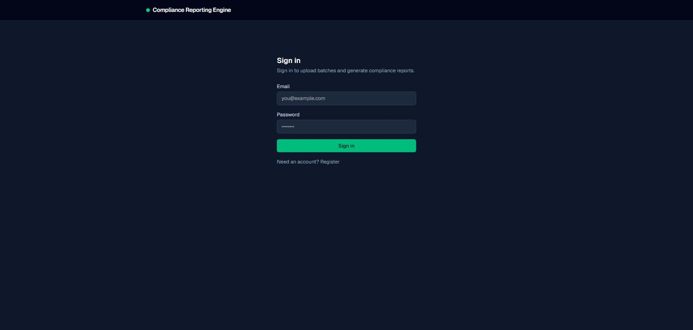
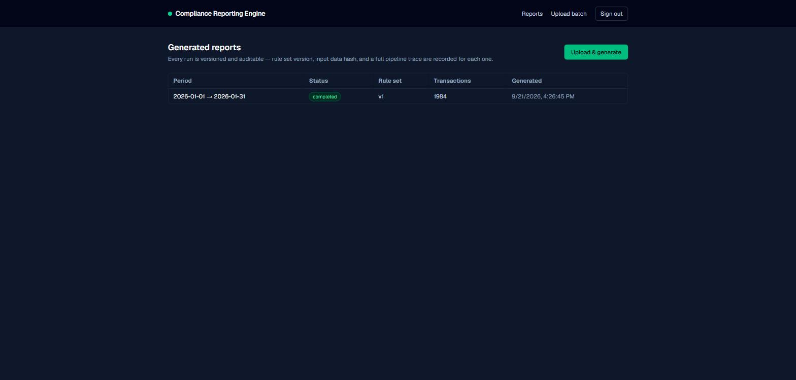
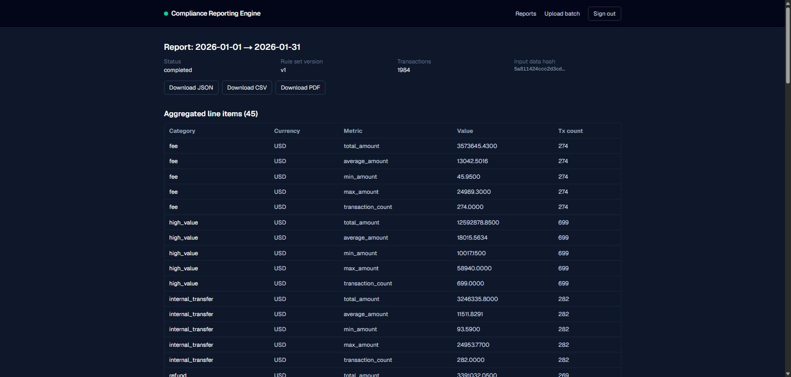
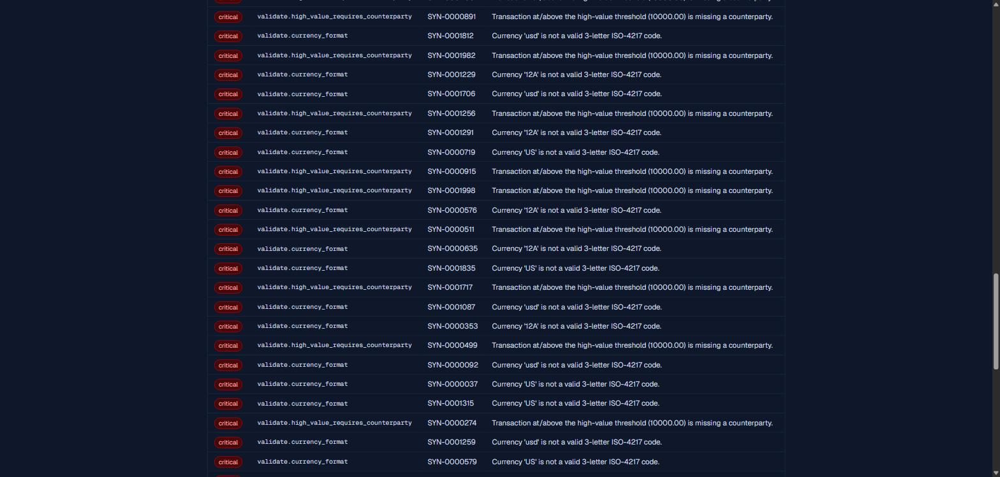
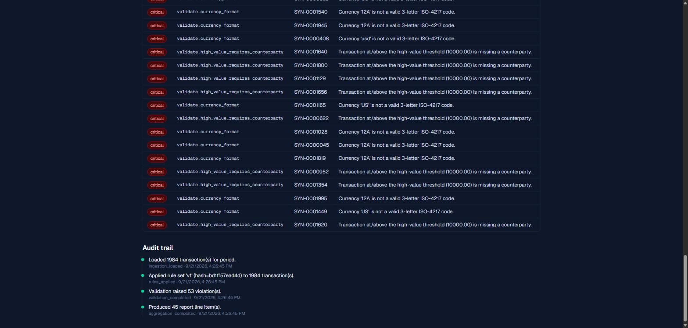
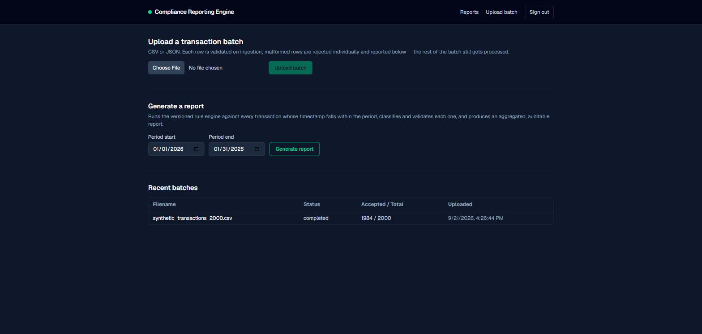
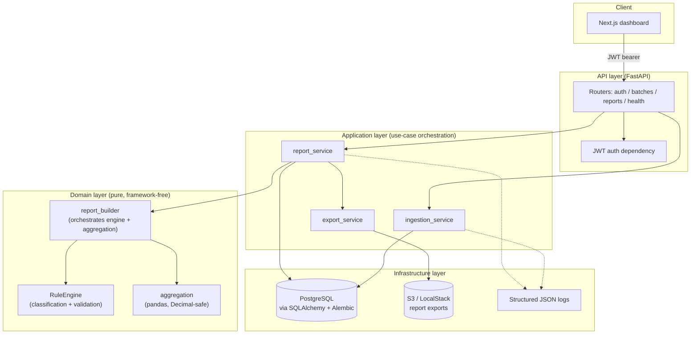

# Compliance Reporting Engine

A backend engine that ingests batches of financial transactions and turns them into **structured, auditable compliance reports** — the kind of pipeline that sits behind recurring regulatory reporting: business-rule validation, aggregation, and full traceability of how every number in the report was produced.

Built as a portfolio project to demonstrate a production-shaped Python/FastAPI backend: a layered architecture, a rule engine that is versioned and independently testable, and an audit trail that answers "how was this number produced?" for every report ever generated.

## The problem it solves

Periodic compliance reporting (AML thresholds, transaction classification, regulatory summaries) needs three things most "just aggregate the data" scripts don't give you:

1. **Business rules that are reviewable and versioned**, not buried in ad-hoc pandas code — because a regulator or auditor will eventually ask "which rules applied to this report, and can you reproduce it?"
2. **Traceability from a report number back to its source transactions** — a total on a report is worthless for compliance if nobody can show which transactions produced it.
3. **A record of what actually happened during generation** — not just the output, but the pipeline trace: what was ingested, what rules ran, what got flagged.

This project implements all three around a small but real domain: transaction classification (retail payment, wire transfer, refund, high-value, etc.) and validation (currency format, threshold, consistency checks).

## Screenshots

| Sign in | Reports list |
|---|---|
|  |  |

| Report detail — line items | Report detail — violations |
|---|---|
|  |  |

| Report detail — audit trail | Upload & generate |
|---|---|
|  |  |

## Architecture



**Layering, and why:**

- **`app/domain`** — the rule engine, classification/validation rules, aggregation, and report-building logic. **Zero imports from FastAPI, SQLAlchemy, or any I/O library.** This is deliberate: the rule engine is the part of this system an interviewer (or a real compliance reviewer) will scrutinize most, so it has to be testable and readable in complete isolation — 37 unit tests exercise it with nothing but plain Python objects, no database, no HTTP, running in under 2 seconds.
- **`app/application`** — use-case orchestration (ingest a batch, generate a report, export it) that wires the pure domain logic to persistence and storage. This is the *only* layer that both touches infrastructure and calls into the domain — keeping that intersection to one place is what makes the domain layer's isolation actually hold.
- **`app/infrastructure`** — SQLAlchemy models/repositories, the S3 client, JWT/password hashing, structured logging. Talks to the outside world; nothing here contains business logic.
- **`app/api`** — FastAPI routers, request/response schemas, auth dependency. Thin — its job is HTTP translation, not decision-making.

### Why the rule engine is isolated

Because it's the part of the system whose *behavior*, not just its correctness, matters: a reviewer needs to read `classification_rules.py` and `validation_rules.py` and understand exactly what will happen to a transaction, without mentally subtracting out ORM sessions, HTTP request/response cycles, or S3 calls. Isolating it also means the engine can be reused verbatim in a batch job, a Lambda, or a CLI — nothing in it assumes it's running inside a web request.

### Why every report run is audited

A compliance report that can't explain itself isn't a compliance report, it's a spreadsheet. Every `ReportRun` persists:

- **`rule_set_version` + `rule_set_definition_hash`** — which rules ran, with a content hash of their identities and order, so drift between "the code says v1" and "the rules that actually executed" is detectable even after the rule catalog evolves.
- **`input_data_hash`** — a SHA-256 fingerprint of the exact transaction set the report was built from (order-independent), so "was this report really generated from this data?" can be verified without re-trusting the pipeline.
- **A step-by-step audit trail** (`audit_log_entries`) — ingestion loaded, rules applied, validation completed, aggregation completed — each with a timestamp.
- **Every violation raised**, with the rule id, severity, and the specific transaction it applies to.
- **Every aggregated line item's source transaction IDs** — so any number on the report can be traced back to exactly which transactions produced it.

Rule *definitions* live in code (`app/domain/rules/registry.py`), not in an editable database table. A new rule set is added by registering a new version (`v2`, ...) rather than mutating `v1` — existing `ReportRun` rows reference a version string, so mutating a released rule set in place would silently rewrite the meaning of past reports. This trades "rules editable at runtime by a non-engineer" for "rules are under the same code review and git history as everything else" — the right call for a compliance-critical ruleset.

## Tech stack

| Layer | Choice | Why |
|---|---|---|
| API | FastAPI | Async-capable, Pydantic-native validation, automatic OpenAPI docs |
| Validation | Pydantic v2 | Strong typing at the API boundary, kept deliberately separate from business-rule validation (see below) |
| ORM / migrations | SQLAlchemy 2.0 + Alembic | Explicit, typed models (`Mapped[...]`); versioned schema changes |
| Database | PostgreSQL (Docker), SQLite (tests) | Real relational integrity in production; zero-dependency fast tests (see [Testing](#testing)) |
| Batch processing | pandas | Used specifically for the groupby/aggregation step at scale — see [Benchmark](#performance--benchmark) |
| Auth | PyJWT + bcrypt (no passlib) | passlib is unmaintained and breaks on modern bcrypt; calling both libraries directly is simpler and has fewer moving parts |
| PDF export | ReportLab | Mature, dependency-light, produces real tabular PDF reports |
| Object storage | boto3 → S3 / LocalStack | Same code path for local demo and real AWS — only the endpoint URL changes |
| Logging | structlog (JSON) | Machine-parseable logs at every pipeline stage |
| Testing | pytest, FastAPI `TestClient`, SQLite | 68 tests, unit + integration, no external services required |
| Frontend | Next.js 16 (App Router) + TypeScript + Tailwind | Minimal, client-rendered dashboard — see [Frontend notes](#frontend-notes) |
| CI/CD | GitHub Actions | Lint, test, and Docker build on every push |

## Project structure

```
backend/
  app/
    domain/            # pure business logic — rule engine, aggregation, report builder
      rules/            #   classification & validation rules, versioned rule sets
      models/            #   framework-free dataclasses (Transaction, ReportResult, ...)
      services/           #   aggregation.py, report_builder.py
    application/        # use-case orchestration (ingestion, report generation, export)
    infrastructure/     # SQLAlchemy models/repositories, S3 client, JWT, logging
    api/                 # FastAPI routers + request/response schemas
    schemas/            # Pydantic DTOs
    core/               # settings (env-var driven)
  alembic/              # migrations
  tests/
    unit/                # domain-only tests, no DB/HTTP
    integration/         # FastAPI TestClient + isolated in-memory SQLite per test
  scripts/
    generate_synthetic_dataset.py
    benchmark.py
  Dockerfile
frontend/
  app/                  # Next.js App Router pages (login, upload, reports list/detail)
  lib/                  # API client, auth context, TypeScript types
  Dockerfile
docker-compose.yml       # api + db (Postgres) + localstack + frontend
.github/workflows/ci.yml
```

## Getting started

### Option A — Docker Compose (recommended)

Brings up PostgreSQL, LocalStack (S3), the API (migrations run automatically on boot), and the dashboard.

```bash
docker compose up --build
```

- API: <http://localhost:8000> (docs at `/docs`, health at `/api/v1/health`)
- Dashboard: <http://localhost:3000>
- Postgres: `localhost:5433` (mapped off the standard 5432 to avoid clashing with a local Postgres install — see `docker-compose.yml`)
- LocalStack S3: `localhost:4566`

Open the dashboard, register a demo account, upload `backend/sample_data/synthetic_transactions_2000.csv` (or generate your own — see below), and generate a report for `2026-01-01`–`2026-01-31`.

### Option B — Run the backend locally (no Docker)

```bash
cd backend
python -m venv .venv
.venv/Scripts/activate       # Windows; use `source .venv/bin/activate` on macOS/Linux
pip install -e ".[dev]"

cp .env.example .env          # then point DATABASE_URL at a Postgres instance you have running
alembic upgrade head
uvicorn app.main:app --reload
```

### Generating a synthetic dataset

```bash
cd backend
python scripts/generate_synthetic_dataset.py --count 5000 --format csv --output sample_data/demo.csv
```

Produces realistic transactions with a small, seeded fraction of deliberately malformed rows (to exercise ingestion rejection) and business-rule violations (to exercise the rule engine) — useful for demos and for the benchmark script.

## API reference

All endpoints are under `/api/v1`. Interactive docs (Swagger UI) are served at `/docs` when the API is running.

| Method | Path | Auth | Purpose |
|---|---|---|---|
| GET | `/health` | — | Liveness + DB connectivity check |
| POST | `/auth/register` | — | Demo-only self-registration (see [Security](#security)) |
| POST | `/auth/login` | — | OAuth2 password flow → JWT access token |
| POST | `/batches/upload` | JWT | Upload a CSV/JSON transaction batch |
| GET | `/batches` | JWT | List recent batches |
| GET | `/batches/{id}` | JWT | Batch detail, incl. rejected rows |
| POST | `/reports` | JWT | Trigger report generation for a period |
| GET | `/reports` | JWT | List generated reports |
| GET | `/reports/{id}` | JWT | Report detail: line items, violations, audit trail |
| GET | `/reports/{id}/export?format=json\|csv\|pdf` | JWT | Download a report export |

## Authentication

JWT (HS256), issued via the standard OAuth2 "password" flow (`POST /auth/login` with `username`/`password` form fields — `username` is the email) so FastAPI's built-in Swagger "Authorize" button works out of the box. Passwords are hashed with `bcrypt` directly (see [Tech stack](#tech-stack) for why not `passlib`).

Deliberately out of scope: refresh tokens, roles/scopes, multi-tenancy. This is a small internal-tool API surface, not a multi-tenant public product — adding that machinery now would be speculative complexity with nothing driving it. If this were productionized for real use, the first thing to add would be role separation (e.g., "can trigger reports" vs. "can only view them").

`POST /auth/register` is intentionally open (no invite code) so this project is runnable end-to-end without a separate seeding step — acceptable for a demo/local environment. A real deployment would gate or remove it.

## The rule engine

Two kinds of rules, evaluated in a fixed order per versioned `RuleSet` (`app/domain/rules/registry.py`):

- **Classification rules** (first match wins) assign a category: `retail_payment`, `wire_transfer`, `internal_transfer`, `refund`, `fee`, `high_value`, `suspicious`. The catch-all `retail_payment` rule is always last.
- **Validation rules** run against the *assigned* category and can raise zero or more violations (`info` / `warning` / `critical`): currency-code format, non-positive amount outside refunds, missing counterparty on a high-value transaction, future-dated transactions.

A deliberate separation exists between **syntactic validation** (Pydantic, at ingestion — is this row shaped correctly?) and **business validation** (the rule engine, at report-generation time — does this transaction satisfy business rules?). Currency format and counterparty-presence are checked by the rule engine, not Pydantic, precisely so the "formato/consistência" validations the engine is meant to demonstrate are real, auditable, per-report-run findings — not silently rejected before the engine ever sees them.

Aggregation groups classified transactions by `(category, currency)` — never mixing currencies into one sum — and computes `total_amount`, `average_amount`, `min_amount`, `max_amount`, and `transaction_count` per group using Python `Decimal` arithmetic throughout (pandas is used for the groupby/indexing machinery, never for the arithmetic itself, so results never pick up binary floating-point rounding error).

## Testing

```bash
cd backend
pytest                              # all 68 tests
pytest tests/unit -v                # 37 unit tests — domain only, no DB/HTTP
pytest tests/integration -v         # 31 integration tests — FastAPI TestClient
pytest --cov=app --cov-report=term-missing
```

- **Unit tests** cover the rule engine's classification/validation logic (including boundary cases — exactly-at-threshold amounts, malformed currency codes, empty batches), the aggregation step (Decimal precision, currency separation), and the end-to-end pure `build_report` pipeline (determinism, input-hash stability).
- **Integration tests** exercise the real API surface — auth, batch upload (CSV and JSON, valid/invalid/empty), report generation and export, 404s, and authorization — against a fresh, isolated in-memory SQLite database per test.

**Why SQLite for integration tests, Postgres in Docker/production:** SQLAlchemy models use the portable `JSON` column type rather than Postgres' native `JSONB`, which is what makes running the integration suite against SQLite possible at all. That's a real trade-off (native JSONB querying is more powerful) made deliberately: the whole test suite runs in ~9 seconds with zero external services, on any machine, in CI, with no Postgres container to provision. Docker Compose and any real deployment still run Postgres.

## Docker & CI/CD

- `backend/Dockerfile` — multi-stage build, non-root user, healthcheck; migrations run automatically on container start via `docker/entrypoint.sh`.
- `frontend/Dockerfile` — multi-stage build using Next.js `standalone` output, runs as the image's built-in non-root `node` user.
- `docker-compose.yml` — `db` (Postgres 16), `localstack` (S3), `api`, `frontend`, wired together with healthchecks so the API doesn't start migrating before Postgres is actually ready.
- `.github/workflows/ci.yml` — on every push/PR to `main`: lint (`ruff` + `black --check`), backend tests (`pytest`), frontend lint/typecheck/build, and a Docker build of both images (not pushed — wire up a registry login step and `push: true` to publish to GHCR/ECR/etc.).

## AWS / S3 export

Report exports (JSON/CSV/PDF) are always written to local disk first (`REPORTS_LOCAL_DIR`), then best-effort mirrored to S3 — a failed S3 upload never fails report generation, since from the report's own correctness standpoint it's a non-essential side effect (logged as a warning, retryable later).

**Local/demo (default, via Docker Compose):** LocalStack stands in for S3 with zero AWS credentials needed. The `api` service is configured with `S3_ENDPOINT_URL=http://localstack:4566` and dummy credentials (`test`/`test`).

**Pointing at real AWS:**

1. Create an S3 bucket (or let Terraform/CloudFormation/your IaC of choice do it — this project provisions the bucket automatically only for the LocalStack case, on the assumption a real bucket is provisioned out-of-band).
2. Set these environment variables on the API (remove `S3_ENDPOINT_URL` entirely — its presence is what switches the client into LocalStack mode):
   ```
   S3_BUCKET_NAME=your-real-bucket
   S3_REGION=us-east-1
   AWS_ACCESS_KEY_ID=...
   AWS_SECRET_ACCESS_KEY=...
   ```
   (Better: omit the access key/secret entirely and run the API with an IAM role/instance profile — boto3 picks that up automatically.)
3. Redeploy. No code changes needed — `app/infrastructure/storage/s3_client.py` is endpoint-agnostic.

### Deploying the API to EC2

This project ships Docker images, so the simplest real deployment is "run the container on a host with Docker":

1. Provision an EC2 instance (e.g. `t3.small`), security group allowing inbound 8000 (or put it behind an ALB on 443 and keep 8000 internal-only).
2. Install Docker (`sudo yum install -y docker && sudo systemctl enable --now docker`, or use an ECS-optimized/Docker-preinstalled AMI).
3. Use a managed **RDS PostgreSQL** instance instead of a containerized database — set `DATABASE_URL` to point at it.
4. Use a real **S3 bucket** as described above, ideally via an **IAM instance profile** attached to the EC2 instance instead of static credentials.
5. Pull and run the image built by CI (push it to ECR/GHCR first):
   ```bash
   docker run -d --name api \
     -e DATABASE_URL=postgresql+psycopg://... \
     -e JWT_SECRET_KEY=$(openssl rand -hex 32) \
     -e S3_BUCKET_NAME=your-bucket -e S3_REGION=us-east-1 \
     -p 8000:8000 \
     your-registry/compliance-reporting-engine-api:latest
   ```
6. Put an ALB (or nginx) with a real TLS certificate in front of it; point the frontend's `NEXT_PUBLIC_API_BASE_URL` build arg at that HTTPS URL.
7. For anything beyond a demo: run migrations as an explicit release step ahead of deploying new replicas (rather than on every container boot, which is what the Docker Compose entrypoint does for one-command local convenience), and put the container behind an autoscaling group / ECS service rather than a single long-lived instance.

## Observability

Structured JSON logging (`structlog`) at every pipeline stage that matters for an auditor: batch received (row counts, checksum), rule engine run (rule set version, duration implicit via timestamps), report generated (line item/violation counts), S3 upload outcome. Every HTTP request is logged with a request ID (returned as `X-Request-ID`) bound into the log context, so every log line emitted while handling a request can be correlated back to it.

## Security

- All input validated with Pydantic at the API boundary (types, required fields, upload size limits, per-batch row limits).
- File uploads: only `.csv`/`.json` extensions accepted, content-type allowlisted, filename sanitized to its basename (no path traversal), and size-capped (`MAX_UPLOAD_SIZE_BYTES`).
- Secrets (`JWT_SECRET_KEY`, DB credentials, AWS keys) are read exclusively from environment variables — `.env` is gitignored, `.env.example` documents every variable with no real value committed.
- Passwords hashed with `bcrypt`, never logged or returned by any endpoint.
- `POST /auth/register` is open by design for demo purposes — see [Authentication](#authentication) for the production caveat.

## Performance / Benchmark

The core pipeline (classify → validate → aggregate, `app.domain.services.report_builder.build_report`) is benchmarked in isolation — no DB, no HTTP, no file I/O — via `scripts/benchmark.py`:

```bash
cd backend
python scripts/benchmark.py --sizes 1000 10000 50000 100000
```

Measured on the author's development machine:

| Transactions | Time (s) | Throughput (tx/sec) |
|---:|---:|---:|
| 1,000 | 0.007 | ~148,800 |
| 10,000 | 0.053 | ~188,000 |
| 50,000 | 0.310 | ~161,100 |
| 100,000 | 0.586 | ~170,600 |

A batch of several thousand transactions — the stated non-functional requirement — processes in well under a second of pure engine time; end-to-end (including HTTP upload, DB writes, and JSON/CSV/PDF export + S3 upload) a 2,000-row CSV batch takes on the order of tens of milliseconds for ingestion and a similar order for report generation in local Docker Compose testing. Re-run the script on your own hardware for your own numbers — results depend heavily on CPU.

## Frontend notes

The dashboard is intentionally minimal — the quality focus of this project is the backend. It's a client-rendered Next.js app (every page is a client component): login/register, upload a batch + trigger a report, list reports, and a report detail view with line items, violations, audit trail, and format-specific export downloads. The JWT lives in the browser's `localStorage` only; there is no server-side session or cookie handling, which keeps the auth story simple and avoids ever needing to forward credentials through a Next.js server layer.

## What's included vs. out of scope

**Included:** layered backend architecture, an isolated and unit-tested rule engine, versioned rule sets with content-hash integrity, full per-run audit trail, CSV/JSON ingestion with row-level validation and rejection reporting, JSON/CSV/PDF export, S3 mirroring (LocalStack for demo, real-AWS path documented), JWT auth, 68 automated tests (unit + integration), Docker + Compose, GitHub Actions CI, structured logging, a functional (if minimal) dashboard.

**Deliberately out of scope** (and why): refresh tokens / role-based access control (no current requirement driving the complexity — see [Authentication](#authentication)); a runtime-editable rule-configuration UI (rules are code, reviewed like code — see [Why every report run is audited](#why-every-report-run-is-audited)); multi-tenancy; rate limiting (would be the next thing added before any public exposure); horizontal scaling / task queue for report generation (current design runs generation synchronously within the request — fine at the target scale of "thousands of transactions", would need to move to a background worker for much larger batches or a public multi-tenant deployment).

## License

MIT — see [LICENSE](LICENSE).
